# 📊 Retail Sales Intelligence Dashboard (Power BI)

> An interactive business intelligence dashboard built in **Microsoft Power BI** to analyze retail sales performance, customer behavior, product insights, and forecast future business trends.

---

## 📌 Project Overview

This project transforms raw retail sales data into an executive-level dashboard that enables stakeholders to monitor KPIs, identify growth opportunities, understand customer purchasing behavior, and make data-driven business decisions.

The dashboard consists of multiple interactive report pages with drill-down capabilities, dynamic filtering, and DAX-powered KPIs.

---

# 🚀 Dashboard Preview

## Executive Overview

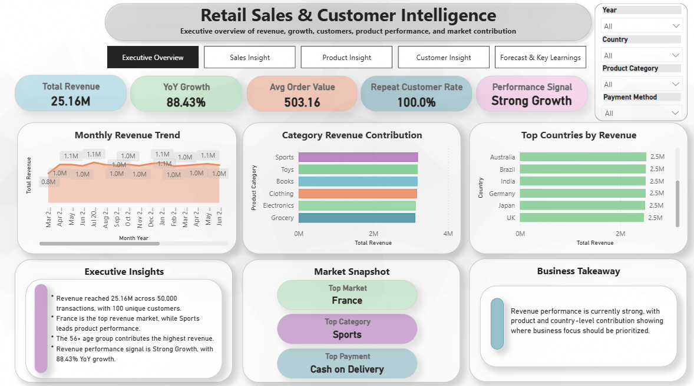
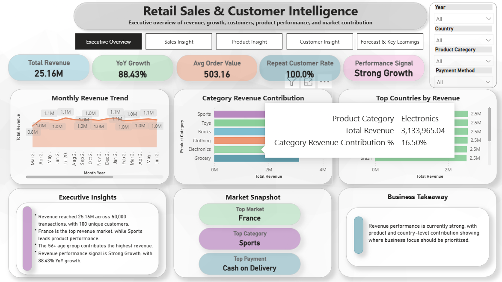


---

## Sales Insight

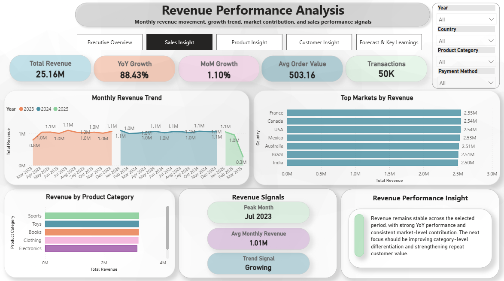
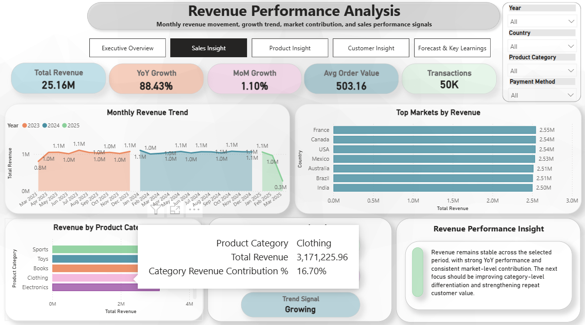
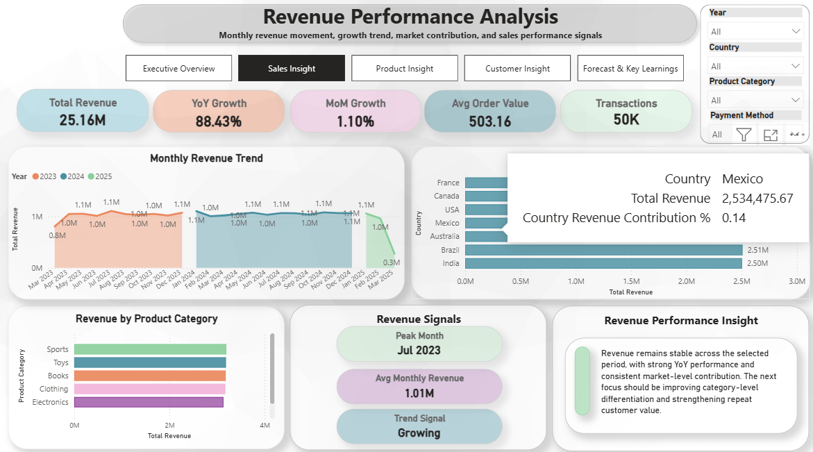

---

## Product Insight

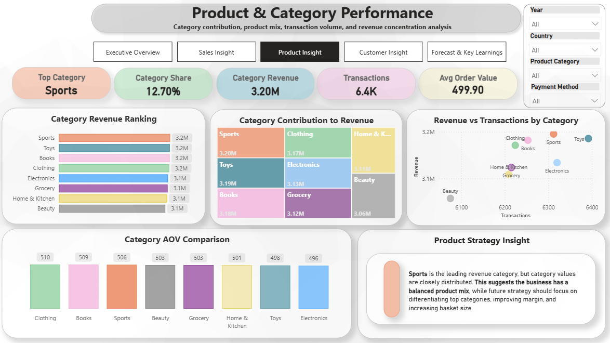
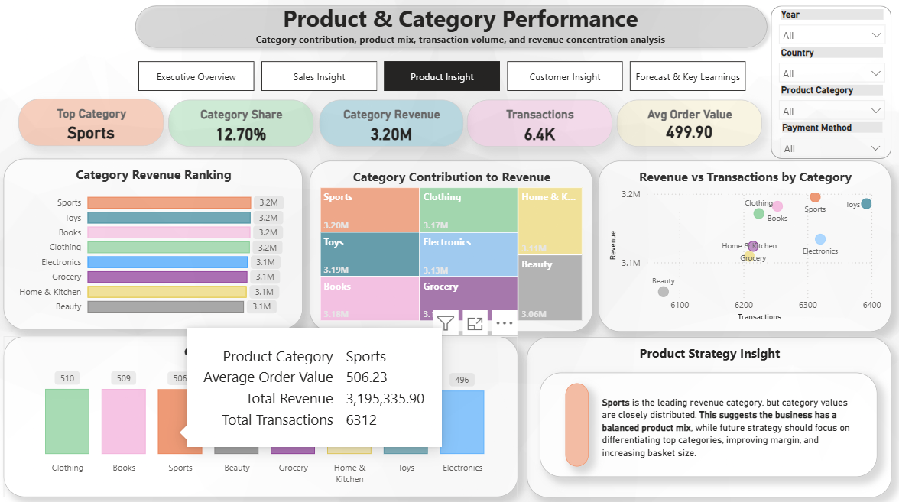

---

## Customer Insight

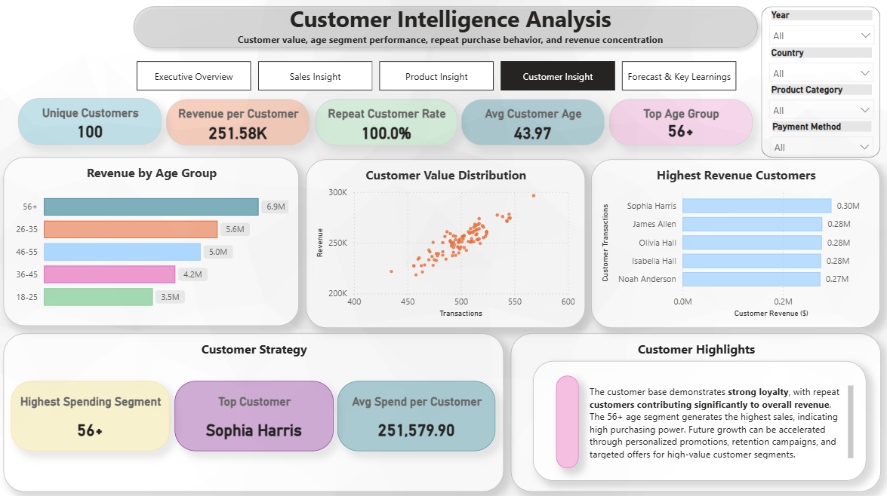
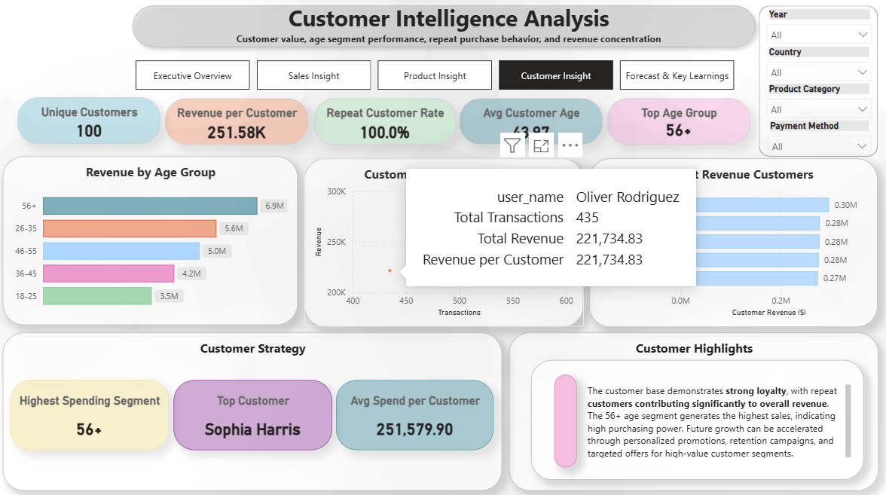

---

## Forecast & Business Recommendations

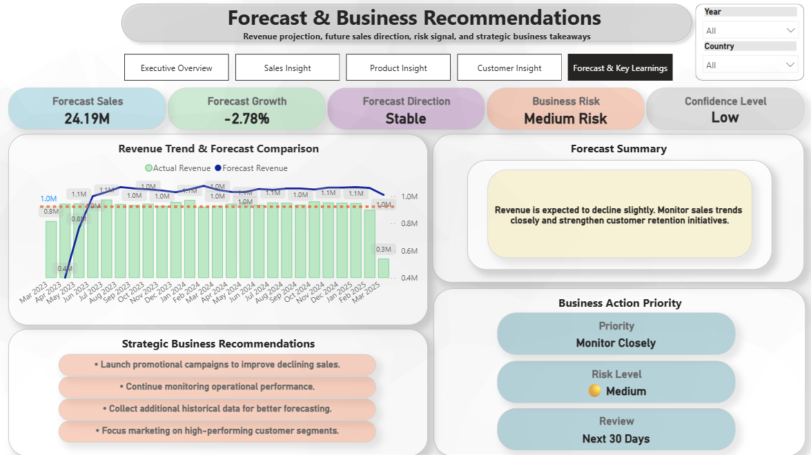
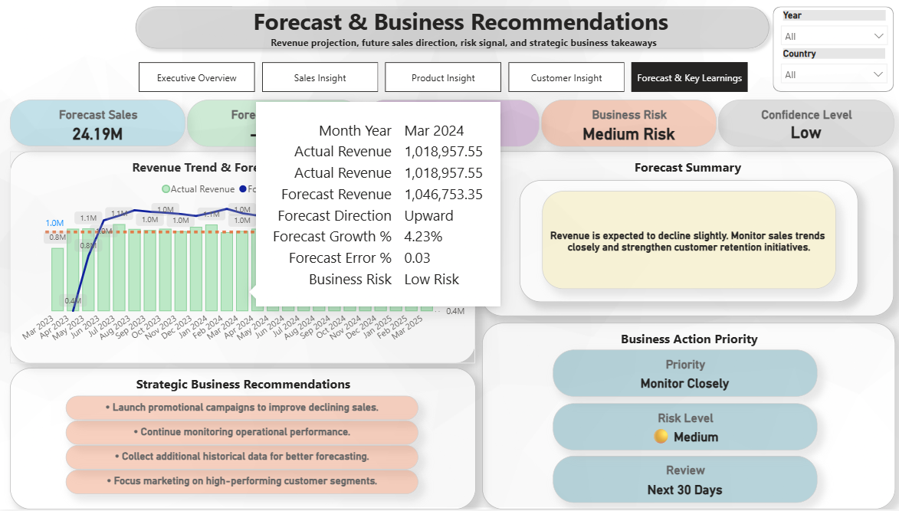
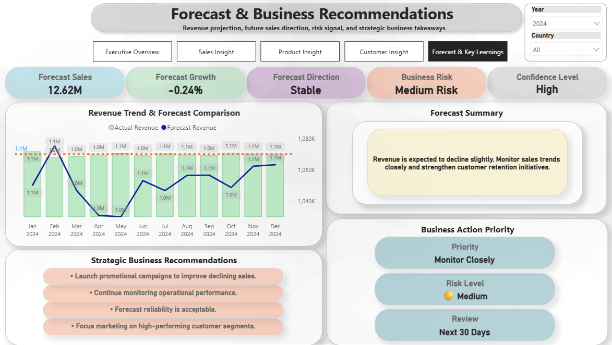

---

# 🎯 Business Objectives

- Monitor overall business performance
- Track sales trends over time
- Analyze product category performance
- Understand customer purchasing behavior
- Identify top-performing markets
- Forecast future revenue trends
- Support strategic business decisions

---

# 📊 Dashboard Pages

## 1️⃣ Executive Overview

Provides a high-level summary of business performance including:

- Total Revenue
- Total Transactions
- Average Order Value
- Unique Customers
- Revenue Trend
- Country Performance
- Product Category Distribution
- Executive Insights

---

## 2️⃣ Sales Insight

Focused on sales analysis across multiple business dimensions.

Includes:

- Monthly Revenue Trend
- Country Revenue Ranking
- Payment Method Analysis
- Category Revenue Distribution
- Average Order Value
- Sales Growth KPIs

---

## 3️⃣ Product Insight

Analyzes product performance and category contribution.

Highlights:

- Top Product Category
- Category Revenue Ranking
- Category Contribution
- Revenue vs Transactions
- Product Mix Analysis
- Strategic Product Recommendations

---

## 4️⃣ Customer Insight

Provides customer segmentation and purchasing behavior analysis.

Includes:

- Unique Customers
- Revenue per Customer
- Repeat Customer Rate
- Customer Age Analysis
- Customer Value Distribution
- Top Customers
- Customer Strategy Recommendations

---

## 5️⃣ Forecast & Business Recommendations

Business forecasting and executive decision support page.

Includes:

- Forecast Revenue
- Forecast Growth
- Business Risk Indicator
- Forecast Direction
- Confidence Level
- Revenue Trend vs Forecast
- Strategic Recommendations
- Business Action Priorities

---

# 📈 KPIs

The dashboard tracks key business metrics including:

- Total Revenue
- Total Transactions
- Average Order Value
- Revenue Growth %
- Forecast Revenue
- Forecast Growth
- Repeat Customer Rate
- Customer Lifetime Value Indicators
- Business Risk Level
- Confidence Level

---

# ⚙️ Power BI Features Used

### Data Modeling

- Star Schema
- Dimension Tables
- Fact Table
- Relationships

### Power Query

- Data Cleaning
- Data Transformation
- Data Type Management

### DAX Measures

Examples include:

- Total Revenue
- Total Transactions
- Average Order Value
- Revenue Growth %
- Forecast Revenue
- Forecast Growth
- Business Risk
- Confidence Level
- Customer KPIs
- Product KPIs

---

# 📊 Visualizations

The dashboard utilizes:

- KPI Cards
- Line Charts
- Clustered Bar Charts
- Column Charts
- Treemap
- Scatter Plot
- Tables
- Dynamic Text Cards
- Slicers
- Navigation Buttons

---

# 🎨 Dashboard Design

The dashboard follows an executive reporting style featuring:

- Clean professional layout
- Soft modern color palette
- Interactive navigation
- Consistent KPI cards
- Responsive filtering
- Business-focused storytelling

---

# 🛠 Tools & Technologies

- Microsoft Power BI
- Power Query
- DAX
- Data Modeling
- Microsoft Excel

---

# 📂 Project Structure

```
Retail-Sales-Intelligence-Dashboard/
│
├── Retail_Sales_Intelligence_Dashboard.pbix
│
├── images/
│   ├── Executive_Overview.png
│   ├── Sales_Insight.png
│   ├── Product_Insight.png
│   ├── Customer_Insight.png
│   └── Forecast_Page.png
│
├── dataset/
│   └── (optional sample dataset)
│
└── README.md
```

---

# 📈 Key Business Insights

- Revenue remains relatively stable throughout the observed period.
- Sports category contributes the highest revenue.
- Customer revenue is concentrated among repeat customers.
- Higher age segments contribute significantly to sales.
- Business risk remains manageable based on recent performance.
- Forecast indicates stable future sales with moderate confidence.

---

# 💡 Skills Demonstrated

- Business Intelligence
- Data Visualization
- Dashboard Design
- DAX Programming
- Data Modeling
- Power Query
- Business Analytics
- KPI Development
- Executive Reporting
- Storytelling with Data

---

# 👩‍💻 Author

**Shamma Samiha**


⭐ If you found this project interesting, feel free to star the repository.
